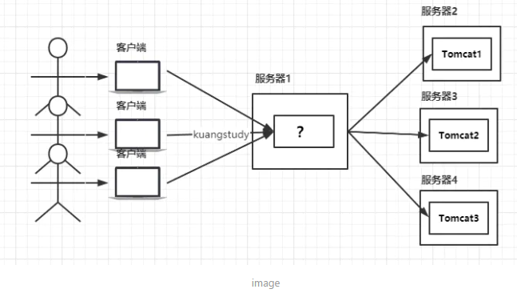
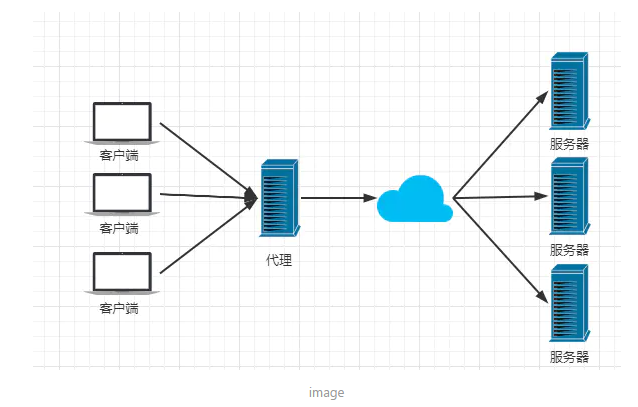
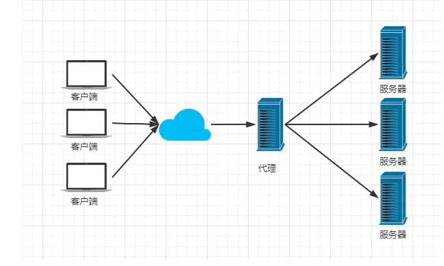
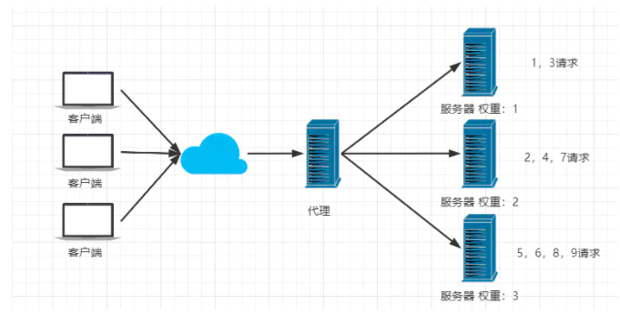
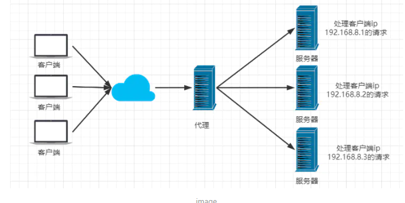
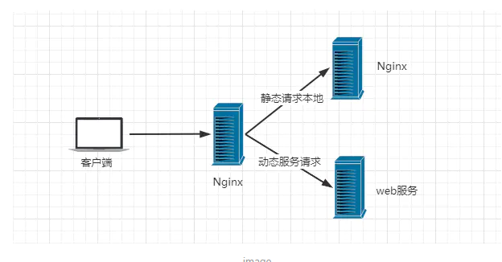
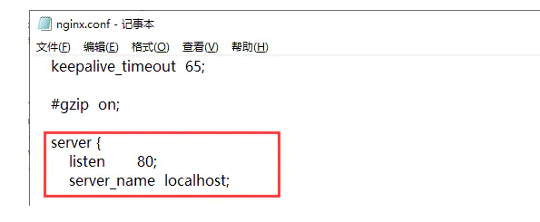

# Nginx简介


## 反向代理、负载均衡、动静分离



## 什么是Nginx？

Nginx (engine x) 是一个高性能的HTTP和反向代理web服务器，同时也提供了IMAP/POP3/SMTP服务。Nginx是由伊戈尔·赛索耶夫为俄罗斯访问量第二的Rambler.ru站点（俄文：Рамблер）开发的，第一个公开版本0.1.0发布于2004年10月4日。2011年6月1日，nginx 1.0.4发布。

其特点是占有内存少，并发能力强，事实上nginx的并发能力在同类型的网页服务器中表现较好，中国大陆使用nginx网站用户有：百度、京东、新浪、网易、腾讯、淘宝等。在全球活跃的网站中有12.18%的使用比率，大约为2220万个网站。

Nginx 是一个安装非常的简单、配置文件非常简洁（还能够支持perl语法）、Bug非常少的服务。Nginx 启动特别容易，并且几乎可以做到7*24不间断运行，即使运行数个月也不需要重新启动。你还能够不间断服务的情况下进行软件版本的升级。

Nginx代码完全用C语言从头写成。官方数据测试表明能够支持高达 50,000 个并发连接数的响应。


## Nginx作用？

Http代理，反向代理：作为web服务器最常用的功能之一，尤其是反向代理。


## 正向代理（VPN）



## 反向代理（Nginx）




## 负载均衡

> Nginx提供的负载均衡策略有2种：内置策略和扩展策略。内置策略为轮询，加权轮询，Ip hash。扩展策略，就天马行空，只有你想不到的没有他做不到的。


轮询


加权轮询



iphash对客户端请求的ip进行hash操作，然后根据hash结果将同一个客户端ip的请求分发给同一台服务器进行处理，可以解决session不共享的问题。




## 动静分离


在我们的软件开发中，有些请求是需要后台处理的，有些请求是不需要经过后台处理的（如：css、html、jpg、js等等文件），这些不需要经过后台处理的文件称为静态文件。让动态网站里的动态网页根据一定规则把不变的资源和经常变的资源区分开来，动静资源做好了拆分以后，我们就可以根据静态资源的特点将其做缓存操作。提高资源响应的速度。




案例：
在Windows浏览器中输入 192.168.1.103/jsp/hello.jsp，跳转到提前准备好的 jsp 页面，这个动态资源请求是有tomcat服务器处理的；输入 192.168.1.103/image/pika.jpg，跳转到提前准备好的图片，这个静态资源请求是由 linux 主机处理的；输入 192.168.1.103/page/a.html，跳转到提前准备好的 html 页面，这个静态资源请求是由 linux 主机处理的。

（1）准备工作
① 在 linux 根目录下新建 static 目录，并在此目录下分别新建 image 目录和 page 目录，在 image 目录中放入准备好的图片 pika.jpg，在 page 目录中放入准备好的页面 a.html
② 在 tomcat 下的 webapps 目录下 新建 jsp 目录，在 jsp 目录中放入提前准备好的页面 hello.jsp
③ 关闭 linux 系统的防火墙或者开放需要被访问的端口

（2）具体配置
① 修改 linux 系统中nginx的配置文件 nginx.conf，默认在 /usr/local/nginx/conf 目录下。
将配置文件中server块的内容修改成如下形式：


## config文件



监听http的80端口，服务器名为localhost 也可以为ip地址。

## linux下安装


## Nginx常用命令

```shell
cd /usr/local/nginx/sbin/
./nginx  启动
./nginx -s stop  停止
./nginx -s quit  安全退出
./nginx -s reload  重新加载配置文件
ps aux|grep nginx  查看nginx进程
```


## 实战实现负载均衡

```cpp
upstream lb{
    server 127.0.0.1:8080 weight=1;
    server 127.0.0.1:8081 weight=1;
}

location / {
    proxy_pass http://lb;
}
```


# Nginx.conf


```nginx.conf

#user  nobody;
worker_processes  1;

#error_log  logs/error.log;
#error_log  logs/error.log  notice;
#error_log  logs/error.log  info;

#pid        logs/nginx.pid;


events {
    worker_connections  1024;
}


http {
    include       mime.types;
    default_type  application/octet-stream;

    #log_format  main  '$remote_addr - $remote_user [$time_local] "$request" '
    #                  '$status $body_bytes_sent "$http_referer" '
    #                  '"$http_user_agent" "$http_x_forwarded_for"';

    #access_log  logs/access.log  main;

    sendfile        on;
    #tcp_nopush     on;

    #keepalive_timeout  0;
    keepalive_timeout  65;

    #gzip  on;

    server {
        listen       80;
        server_name  localhost;

        #charset koi8-r;

        #access_log  logs/host.access.log  main;

        location / {
            root   html;
            index  index.html index.htm;
        }

        #error_page  404              /404.html;

        # redirect server error pages to the static page /50x.html
        #
        error_page   500 502 503 504  /50x.html;
        location = /50x.html {
            root   html;
        }

        # proxy the PHP scripts to Apache listening on 127.0.0.1:80
        #
        #location ~ \.php$ {
        #    proxy_pass   http://127.0.0.1;
        #}

        # pass the PHP scripts to FastCGI server listening on 127.0.0.1:9000
        #
        #location ~ \.php$ {
        #    root           html;
        #    fastcgi_pass   127.0.0.1:9000;
        #    fastcgi_index  index.php;
        #    fastcgi_param  SCRIPT_FILENAME  /scripts$fastcgi_script_name;
        #    include        fastcgi_params;
        #}

        # deny access to .htaccess files, if Apache's document root
        # concurs with nginx's one
        #
        #location ~ /\.ht {
        #    deny  all;
        #}
    }


    # another virtual host using mix of IP-, name-, and port-based configuration
    #
    #server {
    #    listen       8000;
    #    listen       somename:8080;
    #    server_name  somename  alias  another.alias;

    #    location / {
    #        root   html;
    #        index  index.html index.htm;
    #    }
    #}


    # HTTPS server
    #
    #server {
    #    listen       443 ssl;
    #    server_name  localhost;

    #    ssl_certificate      cert.pem;
    #    ssl_certificate_key  cert.key;

    #    ssl_session_cache    shared:SSL:1m;
    #    ssl_session_timeout  5m;

    #    ssl_ciphers  HIGH:!aNULL:!MD5;
    #    ssl_prefer_server_ciphers  on;

    #    location / {
    #        root   html;
    #        index  index.html index.htm;
    #    }
    #}

}

```


##  三部分

**全局块、evens块和http块。**

在http块中又包含http全局块、多个server块。每个server块中，可以包含server全局块和多个location块。


### 全局块

全局块是默认配置文件从开始到events块之间的一部分内容，主要设置一些影响Nginx服务器整体运行的配置指令，因此，这些指令的作用域是Nginx服务器全局。

通常包括配置运行Nginx服务器的用户组、运行生成的worker process数、Nginx进程PID存放路径、日志的存放路径和类型以及配置文件引入等。

### evens块

涉及的指令主要影响Nginx服务器与用户的网络连接。常用的设置包括是否开启对多worker process下的网络连接进行序列化，是否允许同时接收多个网络连接。选取哪种事件驱动模型处理连接请求，每个worker process可以同时支持的最大连接数等。这一部分的指令对Nginx服务器的性能影响较大。

### http块

是Nginx服务器配置中的重要部分，代理、缓存、和日志定义等绝大多数的功能和第三方模块的配置。

#### server块

server块和虚拟主机的概念有密切联系。

包含server全局块、多个location块。

##### location块

和http块相同，server块也可以包含多个location块。从严格意义来说，location其实是server块的一个指令，其在整个Nginx配置文档中起重要的作用！！

主要作用是，基于Nginx服务器接收到的请求字符串（例如，server_name/uri-string），对虚拟主机名称之外的字符串（/uri-string部分）进行匹配，对特定的请

求进行处理。地址定向、数据缓存和应答控制等功能都是在这部分实现。许多第三方模块的配置也是在这块中提供功能。

