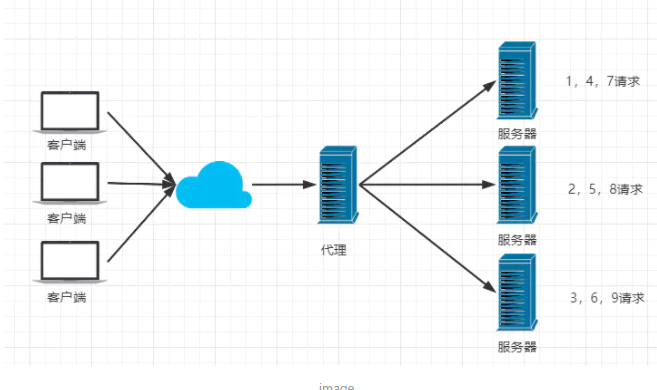

# Nginx基础简介


## 反向代理、负载均衡、动静分离


## 什么是Nginx？

Nginx (engine x) 是一个高性能的HTTP和反向代理web服务器，同时也提供了IMAP/POP3/SMTP服务。Nginx是由伊戈尔·赛索耶夫为俄罗斯访问量第二的Rambler.ru站点（俄文：Рамблер）开发的，第一个公开版本0.1.0发布于2004年10月4日。2011年6月1日，nginx 1.0.4发布。

其特点是占有内存少，并发能力强，事实上nginx的并发能力在同类型的网页服务器中表现较好，中国大陆使用nginx网站用户有：百度、京东、新浪、网易、腾讯、淘宝等。在全球活跃的网站中有12.18%的使用比率，大约为2220万个网站。

Nginx 是一个安装非常的简单、配置文件非常简洁（还能够支持perl语法）、Bug非常少的服务。Nginx 启动特别容易，并且几乎可以做到7*24不间断运行，即使运行数个月也不需要重新启动。你还能够不间断服务的情况下进行软件版本的升级。

Nginx代码完全用C语言从头写成。官方数据测试表明能够支持高达 50,000 个并发连接数的响应。


## Nginx作用？

Http代理，反向代理：作为web服务器最常用的功能之一，尤其是反向代理。


## 正向代理（VPN）


## 反向代理（Nginx）


## 负载均衡

> Nginx提供的负载均衡策略有2种：内置策略和扩展策略。内置策略为轮询，加权轮询，Ip hash。扩展策略，就天马行空，只有你想不到的没有他做不到的。


轮询



加权轮询


iphash对客户端请求的ip进行hash操作，然后根据hash结果将同一个客户端ip的请求分发给同一台服务器进行处理，可以解决session不共享的问题。


## 动静分离


在我们的软件开发中，有些请求是需要后台处理的，有些请求是不需要经过后台处理的（如：css、html、jpg、js等等文件），这些不需要经过后台处理的文件称为静态文件。让动态网站里的动态网页根据一定规则把不变的资源和经常变的资源区分开来，动静资源做好了拆分以后，我们就可以根据静态资源的特点将其做缓存操作。提高资源响应的速度。


案例：
在Windows浏览器中输入 192.168.1.103/jsp/hello.jsp，跳转到提前准备好的 jsp 页面，这个动态资源请求是有tomcat服务器处理的；输入 192.168.1.103/image/pika.jpg，跳转到提前准备好的图片，这个静态资源请求是由 linux 主机处理的；输入 192.168.1.103/page/a.html，跳转到提前准备好的 html 页面，这个静态资源请求是由 linux 主机处理的。

（1）准备工作
① 在 linux 根目录下新建 static 目录，并在此目录下分别新建 image 目录和 page 目录，在 image 目录中放入准备好的图片 pika.jpg，在 page 目录中放入准备好的页面 a.html
② 在 tomcat 下的 webapps 目录下 新建 jsp 目录，在 jsp 目录中放入提前准备好的页面 hello.jsp
③ 关闭 linux 系统的防火墙或者开放需要被访问的端口

（2）具体配置
① 修改 linux 系统中nginx的配置文件 nginx.conf，默认在 /usr/local/nginx/conf 目录下。
将配置文件中server块的内容修改成如下形式：


## config文件


监听http的80端口，服务器名为localhost 也可以为ip地址。

## linux下安装


## Nginx常用命令

```shell
cd /usr/local/nginx/sbin/
./nginx  启动
./nginx -s stop  停止
./nginx -s quit  安全退出
./nginx -s reload  重新加载配置文件
ps aux|grep nginx  查看nginx进程
```


## 实战实现负载均衡

```cpp
upstream lb{
    server 127.0.0.1:8080 weight=1;
    server 127.0.0.1:8081 weight=1;
}

location / {
    proxy_pass http://lb;
}
```


# Nginx.conf


```nginx.conf

#user  nobody;
worker_processes  1;

#error_log  logs/error.log;
#error_log  logs/error.log  notice;
#error_log  logs/error.log  info;

#pid        logs/nginx.pid;


events {
    worker_connections  1024;
}


http {
    include       mime.types;
    default_type  application/octet-stream;

    #log_format  main  '$remote_addr - $remote_user [$time_local] "$request" '
    #                  '$status $body_bytes_sent "$http_referer" '
    #                  '"$http_user_agent" "$http_x_forwarded_for"';

    #access_log  logs/access.log  main;

    sendfile        on;
    #tcp_nopush     on;

    #keepalive_timeout  0;
    keepalive_timeout  65;

    #gzip  on;

    server {
        listen       80;
        server_name  localhost;

        #charset koi8-r;

        #access_log  logs/host.access.log  main;

        location / {
            root   html;
            index  index.html index.htm;
        }

        #error_page  404              /404.html;

        # redirect server error pages to the static page /50x.html
        #
        error_page   500 502 503 504  /50x.html;
        location = /50x.html {
            root   html;
        }

        # proxy the PHP scripts to Apache listening on 127.0.0.1:80
        #
        #location ~ \.php$ {
        #    proxy_pass   http://127.0.0.1;
        #}

        # pass the PHP scripts to FastCGI server listening on 127.0.0.1:9000
        #
        #location ~ \.php$ {
        #    root           html;
        #    fastcgi_pass   127.0.0.1:9000;
        #    fastcgi_index  index.php;
        #    fastcgi_param  SCRIPT_FILENAME  /scripts$fastcgi_script_name;
        #    include        fastcgi_params;
        #}

        # deny access to .htaccess files, if Apache's document root
        # concurs with nginx's one
        #
        #location ~ /\.ht {
        #    deny  all;
        #}
    }


    # another virtual host using mix of IP-, name-, and port-based configuration
    #
    #server {
    #    listen       8000;
    #    listen       somename:8080;
    #    server_name  somename  alias  another.alias;

    #    location / {
    #        root   html;
    #        index  index.html index.htm;
    #    }
    #}


    # HTTPS server
    #
    #server {
    #    listen       443 ssl;
    #    server_name  localhost;

    #    ssl_certificate      cert.pem;
    #    ssl_certificate_key  cert.key;

    #    ssl_session_cache    shared:SSL:1m;
    #    ssl_session_timeout  5m;

    #    ssl_ciphers  HIGH:!aNULL:!MD5;
    #    ssl_prefer_server_ciphers  on;

    #    location / {
    #        root   html;
    #        index  index.html index.htm;
    #    }
    #}

}

```


##  三部分

**全局块、evens块和http块。**

在http块中又包含http全局块、多个server块。每个server块中，可以包含server全局块和多个location块。


### 全局块

全局块是默认配置文件从开始到events块之间的一部分内容，主要设置一些影响Nginx服务器整体运行的配置指令，因此，这些指令的作用域是Nginx服务器全局。

通常包括配置运行Nginx服务器的用户组、运行生成的worker process数、Nginx进程PID存放路径、日志的存放路径和类型以及配置文件引入等。

### evens块

涉及的指令主要影响Nginx服务器与用户的网络连接。常用的设置包括是否开启对多worker process下的网络连接进行序列化，是否允许同时接收多个网络连接。选取哪种事件驱动模型处理连接请求，每个worker process可以同时支持的最大连接数等。这一部分的指令对Nginx服务器的性能影响较大。

### http块

是Nginx服务器配置中的重要部分，代理、缓存、和日志定义等绝大多数的功能和第三方模块的配置。

#### server块

server块和虚拟主机的概念有密切联系。

包含server全局块、多个location块。

##### location块

和http块相同，server块也可以包含多个location块。从严格意义来说，location其实是server块的一个指令，其在整个Nginx配置文档中起重要的作用！！

主要作用是，基于Nginx服务器接收到的请求字符串（例如，server_name/uri-string），对虚拟主机名称之外的字符串（/uri-string部分）进行匹配，对特定的请

求进行处理。地址定向、数据缓存和应答控制等功能都是在这部分实现。许多第三方模块的配置也是在这块中提供功能。


# Nginx架构

nginx 在启动后，在 unix 系统中会以 daemon 的方式在后台运行，后台进程包含一个 master 进程和多个

worker 进程。我们也可以手动地关掉 daemon 模式，让 nginx 在前台运行，这个时候，nginx 就是一个单进

程的，很显然，生产环境下我们肯定不会这么做，所以关掉 daemon 的方式，一般是用来调试用的，在后面的

章节里面，我们会详细地讲解如何调试 nginx。所以，我们可以看到，nginx 是以多进程的方式来工作的，当然

nginx 也是支持多线程的方式的，只是我们主流的方式还是多进程的方式，也是 nginx 的默认方式。nginx 采

用多进程的方式有诸多好处，所以我就主要讲解 nginx 的多进程模式吧。


刚才讲到，nginx 在启动后，会有一个 master 进程和多个 worker 进程。master 进程主要用来管理 worker

进程，包含：接收来自外界的信号，向各 worker 进程发送信号，监控 worker 进程的运行状态，当 worker

进程退出后 (异常情况下)，会自动重新启动新的 worker 进程。而基本的网络事件，则是放在 worker 进程中

来处理了。多个 worker 进程之间是对等的，他们同等竞争来自客户端的请求，各进程互相之间是独立的。一个

请求，只可能在一个 worker 进程中处理，一个 worker 进程，不可能处理其它进程的请求。worker 进程的

个数是可以设置的，一般我们会设置与机器 cpu 核数一致，这里面的原因与 nginx 的进程模型以及事件处理模

型是分不开的。nginx 的进程模型，可以由下图来表示


在 nginx 启动后，如果我们要操作 nginx，要怎么做呢？从上文中我们可以看到，master 来管理 worker 进程，所以我们只需要与 master 进程通信就行了。master 进程会接收来自外界发来的信号，再根据信号做不同的事情。所以我们要控制 nginx，只需要通过 kill 向 master 进程发送信号就行了。比如 kill -HUP pid，则是告诉 nginx，从容地重启 nginx，我们一般用这个信号来重启 nginx，或重新加载配置，因为是从容地重启，

因此服务是不中断的。master 进程在接收到 HUP 信号后是怎么做的呢？首先 master 进程在接到信号后，会

先重新加载配置文件，然后再启动新的进程，并向所有老的进程发送信号，告诉他们可以光荣退休了。新的进程

在启动后，就开始接收新的请求，而老的进程在收到来自 master 的信号后，就不再接收新的请求，并且在当前

进程中的所有未处理完的请求处理完成后，再退出。当然，直接给 master 进程发送信号，这是比较老的操作方

式，nginx 在 0.8 版本之后，引入了一系列命令行参数，来方便我们管理。比如，./nginx -s reload，就是来

重启 nginx，./nginx -s stop，就是来停止 nginx 的运行。如何做到的呢？我们还是拿 reload 来说，我们看

到，执行命令时，我们是启动一个新的 nginx 进程，而新的 nginx 进程在解析到 reload 参数后，就知道我们

的目的是控制 nginx 来重新加载配置文件了，它会向 master 进程发送信号，然后接下来的动作，就和我们直

接向 master 进程发送信号一样了。

现在，我们知道了当我们在操作 nginx 的时候，nginx 内部做了些什么事情，那么，worker 进程又是如何

处理请求的呢？我们前面有提到，worker 进程之间是平等的，每个进程，处理请求的机会也是一样的。当我

们提供 80 端口的 http 服务时，一个连接请求过来，每个进程都有可能处理这个连接，怎么做到的呢？首先，

每个 worker 进程都是从 master 进程 fork 过来，在 master 进程里面，先建立好需要 listen 的 socket 之 

后，然后再 fork 出多个 worker 进程，这样每个 worker 进程都可以去 accept 这个 socket(当然不是同一

个 socket，只是每个进程的这个 socket 会监控在同一个 ip 地址与端口，这个在网络协议里面是允许的)。一

般来说，当一个连接进来后，所有在 accept 在这个 socket 上面的进程，都会收到通知，而只有一个进程可以

accept 这个连接，其它的则 accept 失败，这是所谓的惊群现象。当然，nginx 也不会视而不见，所以 nginx

提供了一个 accept_mutex 这个东西，从名字上，我们可以看这是一个加在 accept 上的一把共享锁。有了这

把锁之后，同一时刻，就只会有一个进程在 accpet 连接，这样就不会有惊群问题了。accept_mutex 是一个

可控选项，我们可以显示地关掉，默认是打开的。当一个 worker 进程在 accept 这个连接之后，就开始读取请

求，解析请求，处理请求，产生数据后，再返回给客户端，最后才断开连接，这样一个完整的请求就是这样的

了。我们可以看到，一个请求，完全由 worker 进程来处理，而且只在一个 worker 进程中处理。

那么，nginx 采用这种进程模型有什么好处呢？当然，好处肯定会很多了。首先，对于每个 worker 进程来说，

独立的进程，不需要加锁，所以省掉了锁带来的开销，同时在编程以及问题查上时，也会方便很多。其次，采用

独立的进程，可以让互相之间不会影响，一个进程退出后，其它进程还在工作，服务不会中断，master 进程则

很快重新启动新的 worker 进程。当然，worker 进程的异常退出，肯定是程序有 bug 了，异常退出，会导致

当前 worker 上的所有请求失败，不过不会影响到所有请求，所以降低了风险。当然，好处还有很多，大家可以

慢慢体会。

上面讲了很多关于 nginx 的进程模型，接下来，我们来看看 nginx 的是如何处理事件的。

有人可能要问了，nginx 采用多 worker 的方式来处理请求，每个 worker 里面只有一个主线程，那能够处

理的并发数很有限啊，多少个 worker 就能处理多少个并发，何来高并发呢？非也，这就是 nginx 的高明之

处，nginx 采用了异步非阻塞的方式来处理请求，也就是说，nginx 是可以同时处理成千上万个请求的。想想

apache 的常用工作方式（apache 也有异步非阻塞版本，但因其与自带某些模块冲突，所以不常用），每个请

求会独占一个工作线程，当并发数上到几千时，就同时有几千的线程在处理请求了。这对操作系统来说，是个不

小的挑战，线程带来的内存占用非常大，线程的上下文切换带来的 cpu 开销很大，自然性能就上不去了，而这

些开销完全是没有意义的。

为什么 nginx 可以采用异步非阻塞的方式来处理呢，或者异步非阻塞到底是怎么回事呢？我们先回到原点，看

看一个请求的完整过程。首先，请求过来，要建立连接，然后再接收数据，接收数据后，再发送数据。具体到系

统底层，就是读写事件，而当读写事件没有准备好时，必然不可操作，如果不用非阻塞的方式来调用，那就得

阻塞调用了，事件没有准备好，那就只能等了，等事件准备好了，你再继续吧。阻塞调用会进入内核等待，cpu

就会让出去给别人用了，对单线程的 worker 来说，显然不合适，当网络事件越多时，大家都在等待呢，cpu

空闲下来没人用，cpu 利用率自然上不去了，更别谈高并发了。好吧，你说加进程数，这跟 apache 的线程模

型有什么区别，注意，别增加无谓的上下文切换？所以，在 nginx 里面，最忌讳阻塞的系统调用了。不要阻塞，

那就非阻塞喽。非阻塞就是，事件没有准备好，马上返回 EAGAIN，告诉你，事件还没准备好呢，你慌什么，

过会再来吧。好吧，你过一会，再来检查一下事件，直到事件准备好了为止，在这期间，你就可以先去做其它

事情，然后再来看看事件好了没。虽然不阻塞了，但你得不时地过来检查一下事件的状态，你可以做更多的事

情了，但带来的开销也是不小的。所以，才会有了异步非阻塞的事件处理机制，具体到系统调用就是像 select/

poll/epoll/kqueue 这样的系统调用。它们提供了一种机制，让你可以同时监控多个事件，调用他们是阻塞的，

但可以设置超时时间，在超时时间之内，如果有事件准备好了，就返回。这种机制正好解决了我们上面的两个问

题，拿 epoll 为例 (在后面的例子中，我们多以 epoll 为例子，以代表这一类函数)，当事件没准备好时，放到

epoll 里面，事件准备好了，我们就去读写，当读写返回 EAGAIN 时，我们将它再次加入到 epoll 里面。这样，

只要有事件准备好了，我们就去处理它，只有当所有事件都没准备好时，才在 epoll 里面等着。这样，我们就可

以并发处理大量的并发了，当然，这里的并发请求，是指未处理完的请求，线程只有一个，所以同时能处理的请


求当然只有一个了，只是在请求间进行不断地切换而已，切换也是因为异步事件未准备好，而主动让出的。这里

的切换是没有任何代价，你可以理解为循环处理多个准备好的事件，事实上就是这样的。与多线程相比，这种事

件处理方式是有很大的优势的，不需要创建线程，每个请求占用的内存也很少，没有上下文切换，事件处理非常

的轻量级。并发数再多也不会导致无谓的资源浪费（上下文切换）。更多的并发数，只是会占用更多的内存而已。

我之前有对连接数进行过测试，在 24G 内存的机器上，处理的并发请求数达到过 200 万。现在的网络服务器基

本都采用这种方式，这也是 nginx 性能高效的主要原因。

我们之前说过，推荐设置 worker 的个数为 cpu 的核数，在这里就很容易理解了，更多的 worker 数，只会

导致进程来竞争 cpu 资源了，从而带来不必要的上下文切换。而且，nginx 为了更好的利用多核特性，提供了

cpu 亲缘性的绑定选项，我们可以将某一个进程绑定在某一个核上，这样就不会因为进程的切换带来 cache 的

失效。像这种小的优化在 nginx 中非常常见，同时也说明了 nginx 作者的苦心孤诣。比如，nginx 在做 4 个字

节的字符串比较时，会将 4 个字符转换成一个 int 型，再作比较，以减少 cpu 的指令数等等。

现在，知道了 nginx 什么会选择这样的进程模型与事件模型了。对于一个基本的 web 服务器来说，事件通常有

三种类型，网络事件、信号、定时器。从上面的讲解中知道，网络事件通过异步非阻塞可以很好的解决掉。如何

处理信号与定时器？

首先，信号的处理。对 nginx 来说，有一些特定的信号，代表着特定的意义。信号会中断掉程序当前的运行，

在改变状态后，继续执行。如果是系统调用，则可能会导致系统调用的失败，需要重入。关于信号的处理，大家

可以学习一些专业书籍，这里不多说。对于 nginx 来说，如果 nginx 正在等待事件（epoll_wait 时），如果程

序收到信号，在信号处理函数处理完后，epoll_wait 会返回错误，然后程序可再次进入 epoll_wait 调用。

另外，再来看看定时器。由于 epoll_wait 等函数在调用的时候是可以设置一个超时时间的，所以 nginx 借助这

个超时时间来实现定时器。nginx 里面的定时器事件是放在一个最小堆里面，每次在进入 epoll_wait 前，先从

最小堆里面拿到所有定时器事件的最小时间，在计算出 epoll_wait 的超时时间后进入 epoll_wait。所以，当没

有事件产生，也没有中断信号时，epoll_wait 会超时，也就是说，定时器事件到了。这时，nginx 会检查所有

的超时事件，将他们的状态设置为超时，然后再去处理网络事件。由此可以看出，当我们写 nginx 代码时，在

处理网络事件的回调函数时，通常做的第一个事情就是判断超时，然后再去处理网络事件。


# Nginx的事件驱动模型


